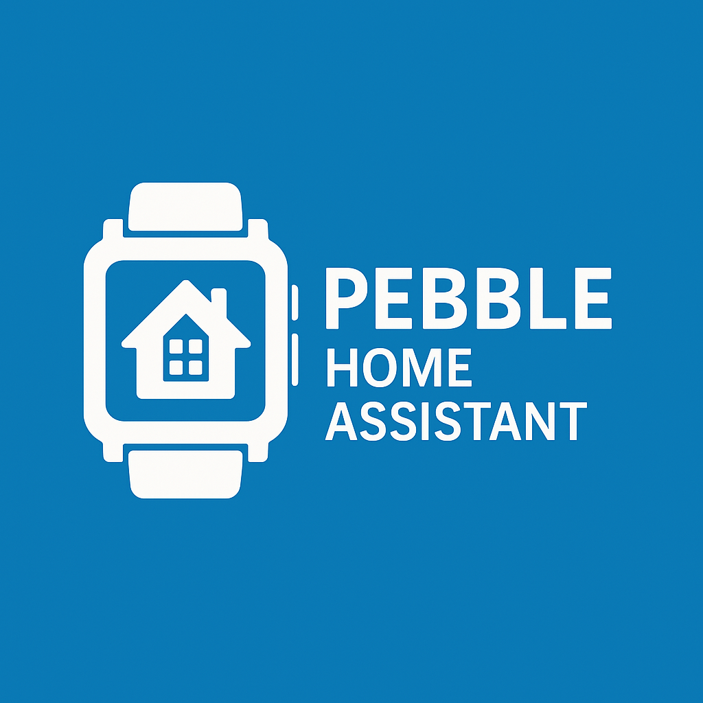

# Pebble Home Assistant WS

Control your Home Assistant smart home directly from your Pebble smartwatch! This app uses WebSockets for real-time updates and control of your Home Assistant devices and entities.



## Features

### Real-time Home Assistant Integration
- **WebSocket Connection**: Live updates and faster response times compared to REST API
- **Two-way Communication**: Send commands and receive instant status updates
- **Reliable Connection**: Automatic reconnection if connection is lost

### Voice Control
- **Dictation Interface**: Control your smart home with voice commands
- **Multiple Conversation Agents**: Support for any conversation agents configured in Home Assistant (ChatGPT, Assist, Home Assistant, etc.)
- **Custom Agent Selection**: Easily switch between different conversation agents
- **Scrollable Responses**: Review longer assistant responses with built-in scrolling

### Entity Management
- **Entity Browsing**: View and control all your entities
- **Area Organization**: Browse entities by room/area for easier navigation
- **Domain Filtering**: Filter entities by type (lights, switches, etc.)
- **Favorites**: Save frequently used entities for quick access
- **Pagination**: Efficiently navigate through large numbers of entities

### UI Features
- **Detailed Entity Info**: View all attributes and states
- **Media Controls**: Dedicated interface for controlling media players
- **Real-time Updates**: Entity states update instantly as they change
- **Accessible Interface**: Optimized for the small Pebble screen

## Installation

1. **Download the app**:
   - Get the latest release from the [releases page](https://github.com/skylord123/pebble-home-assistant-ws/releases)
   - Or install directly from the Pebble app store (search for "Home Assistant WS")

2. **Install on your Pebble**:
   - Use the Pebble app on your phone to install the downloaded .pbw file
   - Alternatively, install directly through the Pebble app store

## Configuration

After installation, you'll need to configure the app to connect to your Home Assistant instance:

1. **Open the settings** for the app in the Pebble smartphone app
2. **Enter your Home Assistant details**:
   - **URL**: Your Home Assistant URL (e.g., `https://yourhomeassistant.duckdns.org`)
   - **Access Token**: A [Long-Lived Access Token](https://www.home-assistant.io/docs/authentication/) from Home Assistant
   - **Refresh Interval**: How often to refresh entity states (in minutes)
   - **Voice Confirmation**: Enable/disable voice command confirmation
   - **Enable Voice**: Turn on/off voice assistant functionality

### Home Assistant Setup Requirements

- Enable the [Conversation integration](https://www.home-assistant.io/integrations/conversation/) for voice control
- Optional: Configure additional conversation agents (like ChatGPT) for enhanced voice control

## Using the App

### Main Menu

- **Voice Assistant**: Access voice controls (if enabled)
- **Favorites**: View and control favorite entities
- **Areas**: Browse entities organized by room/area
- **All Entities**: Browse all available entities by type

### Voice Control

1. Select "Voice Assistant" from the main menu
2. Press the middle button to start dictation
3. Speak your command (e.g., "Turn on the kitchen lights" or "What's the temperature outside?")
4. View the response and scroll if needed using up/down buttons
5. Long-press the middle button to change conversation agents

### Entity Control

- **Short press** on an entity to view its details and controls
- **Long press** on compatible entities (lights, switches, etc.) to toggle them directly
- For media players, use the dedicated control screen with volume and playback controls
- Add frequently used entities to favorites for quicker access

## Troubleshooting

- **Connection Issues**: Verify your Home Assistant URL and token are correct
- **Entity Not Responding**: Check that the entity is available in Home Assistant
- **Voice Commands Not Working**: Ensure the conversation integration is enabled in Home Assistant
- **App Crashes**: Try restarting your Pebble watch
- **Entity Changes Not Updating**: Adjust the refresh interval in settings

## Development

This app is built using Pebble.js and is open source. Contributions are welcome!

- **GitHub Repository**: [github.com/yourusername/pebble-ha-ws](https://github.com/yourusername/pebble-ha-ws)
- **Bug Reports**: Please use the GitHub issues page to report bugs
- **Feature Requests**: Feel free to suggest new features through GitHub issues

### Building From Source

This requires the pebble sdk. Go into the Pebble app on your phone and enable the Developer Connection. Use the "Server IP" in the sample below to install the app over the network to your watch.

```bash
# Clone the repository
git clone https://github.com/skylord123/pebble-home-assistant-ws.git
cd pebble-ha-ws

# Install dependencies
npm install

# Build the app
pebble build

# Install on your Pebble (when connected)
pebble install --logs --phone 192.168.1.100
```

## Motivation

I recently dusted off my Pebble watch and wanted to start using it again. Controlling Home Assistant was at the top of my list of wants for a smartwatch.

While other Home Assistant applications existed, none of them offered complete device control at the time this project started. The existing voice assistant (Snowy) didn't work with Home Assistant, and the Home Assistant conversation API was only accessible via WebSockets.

Converting the entire application to use WebSockets not only enabled voice control but also provided the benefits of live event updates and access to additional endpoints not available through the REST API.

## Acknowledgements

- Thanks to the Home Assistant team for their excellent API documentation
- Special thanks to the Pebble developer community for keeping the platform alive
- Thanks to all contributors who have helped improve this application

## License

This project is licensed under the MIT License - see the LICENSE file for details.